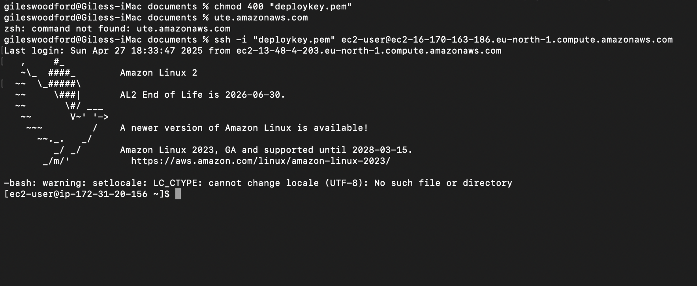
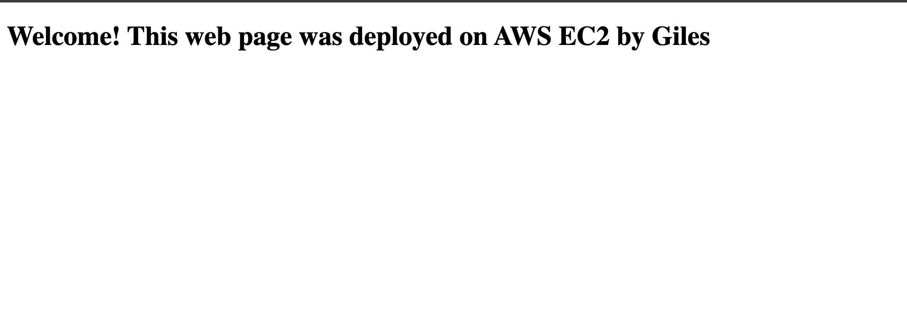

# EC2deploy
# Web App Deployment on AWS EC2

## Overview
This project demonstrates the deployment of a basic web application using AWS EC2 service.  
A Linux virtual machine was launched, configured with a web server (Nginx), and hosted a custom web page.

## AWS Services Used
- EC2 (Elastic Compute Cloud)
- Security Groups (Firewall)
- Amazon Linux 2 AMI

## Skills Demonstrated
- EC2 instance creation and management
- Security group configuration (SSH, HTTP)
- Linux server administration
- Web server deployment with Nginx

## How to Reproduce
1. Launch an EC2 instance (Amazon Linux 2, t3.micro)
2. Open ports 22 (SSH) and 80 (HTTP) in the Security Group
3. SSH into the instance
4. Install and start Nginx
5. Replace the default HTML page with a custom one
6. Access the public IP in a browser

## Screenshots

## Author
Giles Woodford
